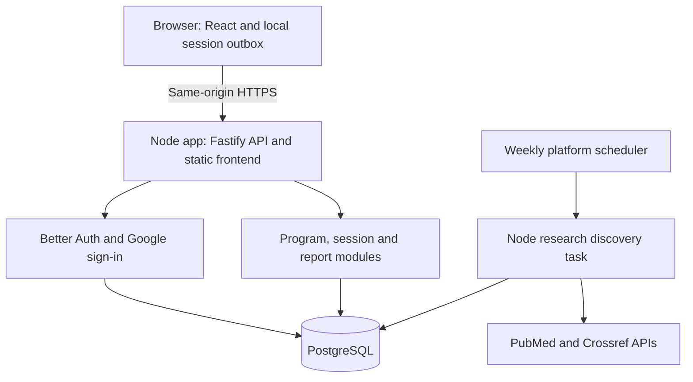
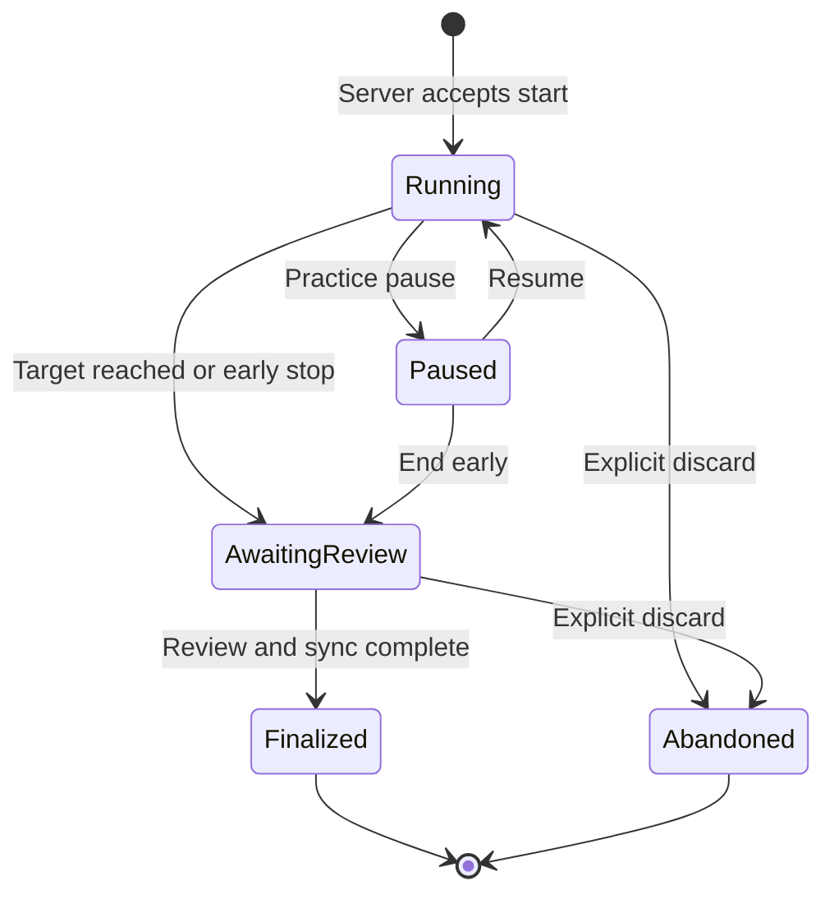
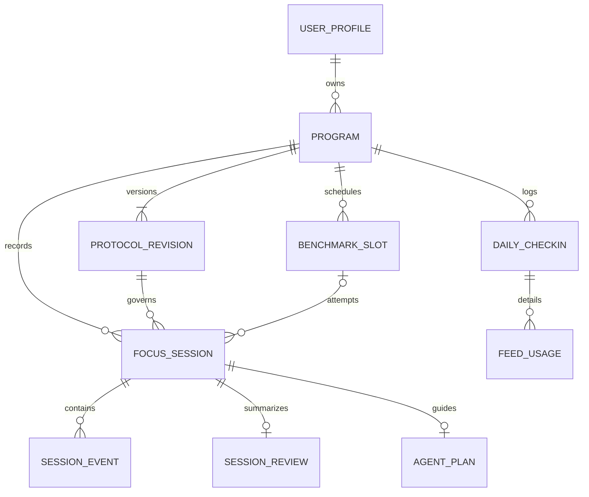

# Attention Lab — Technical PoC specification

Status: proposed design, not implemented · Version 0.1 · 6 September 2026
Prepared for Douglas Rojas · Language: TypeScript on frontend and backend

## 1. Product proposition

Attention Lab helps a knowledge worker run a 14-day attention practice experiment: establish a baseline, protect two daily work blocks, manage AI-agent waiting, record social-feed use across devices, and compare final results with baseline. The product should help the user return to useful work and spend little time in the app.

The operating principle is **measurable improvement over perfection**. Planned leisure scrolling is compatible with the program. There is no diagnostic attention score, requirement to reach flow, punitive streak, or promise of neurological recovery.

This document is a proposed technical proof of concept: product boundaries, wireframe specifications, stack, architecture, data model, API surface, algorithms in prose, reliability behavior, delivery plan, and acceptance criteria. It contains no application implementation, executable examples, SQL definitions, or scaffold. Mermaid blocks are design diagrams only.

### Context and design decisions

- Source: our Attention-Recovery-14-Day-Plan, version 1.1. The September 6 flexible feed rules supersede the original abstinence proposal.
- Initial user: Douglas, a TypeScript-capable software engineer who uses AI agents. A private pilot may include up to ten invited adults; that is a design assumption, not an existing cohort.
- Desktop first for work and benchmarking; mobile-responsive for daily logging and review.
- Default timezone: detected with explicit confirmation; America/La_Paz for Douglas. The browser environment timezone must not silently override the chosen timezone.
- Start date is chosen by the user. No baseline scores or real attention measurements exist yet.
- Existing ChatGPT research automation remains separate. This PoC does not assume access to it or silently create duplicate notifications.

### Questions the PoC must answer

| Hypothesis | Observable signal | What would challenge it |
|---|---|---|
| Users can follow the protocol with little administration | At least 10 of 14 daily logs; typical daily log under two minutes | Tracking itself interrupts work or requires too many fields |
| Benchmark records are comparable and understandable | Two eligible baseline and two eligible final sessions; visible quality/confounder notes | Missing data, timing ambiguity, or users treating tab visibility as attention |
| Agent-wait planning reduces fragmented work | Fewer self-reported unplanned checks and more useful completed blocks | Users keep opening the app to check the timer or agents |
| The architecture preserves results under ordinary failures | Refresh, temporary disconnection, duplicate submissions, and multi-tab cases preserve consistent records | Lost or duplicated events; fabricated completion after device sleep |

These are feasibility hypotheses. A small uncontrolled pilot cannot establish clinical efficacy or isolate the effect of a specific intervention.

## 2. Scope

| Area | Included in the PoC | Deferred |
|---|---|---|
| Program | Day 0 baseline, Days 1–14 practice, Day 14 comparison; optional Day 7 check | Multiple concurrent programs; clinician programs |
| Sessions | Reading, reasoning, software-work practice; manual interruption tally; useful-output review | Automated classification of what the user is doing |
| Agent workflow | Workstream, waiting task, review checkpoint, ready-to-resume note | Claude Code/OpenCode integrations, agent execution, terminal monitoring |
| Feed tracking | Daily manual estimates or device-report transcription, by device and platform | OS-wide screen-time APIs, scraping social accounts, browser extension |
| Research | Curated source cards; weekly PubMed candidate discovery; manual approval into a bounded digest | Fully autonomous evidence assessment, general-news crawling, LLM coaching |
| Account | Invite-only Google sign-in using a maintained auth library; user-owned records | Teams, billing, social comparisons |
| Portability | CSV and Markdown exports, account deletion | PDF generation, mobile-native apps |
| Offline behavior | Continue an already-started session and queue its events | Full offline application or new benchmark starts while offline |

The research discovery step is optional to the first vertical slice but included in the complete PoC design. If it delays testing the core attention loop, ship the pilot with curated cards and enable discovery next. No Redis, vector database, Kubernetes, or separate microservices are required at this scale.

## 3. Recommended technology stack

Choose supported stable releases at implementation kickoff, pin exact compatible versions, and retain a lockfile. No code has been created and no dependency compatibility has been tested in this design phase.

| Layer | Choice | Reason |
|---|---|---|
| Frontend | React + TypeScript, Vite | An authenticated, interaction-heavy app does not need server-rendered public pages. React documents a Vite/TypeScript path. [T1] |
| Routing | React Router | Explicit routes for Today, Session, Progress, Research, Settings; prevent accidental exit from unsaved work |
| Remote state | TanStack Query | API cache, mutations, loading/error state; disable automatic window-focus refetch during timed sessions. [T2] |
| Local session state | React reducer + IndexedDB outbox | Small explicit session state machine; recover queued events without making the entire app offline-first |
| UI | Tailwind CSS + Radix UI primitives | Consistent spacing and accessible base controls; restrained visual system |
| Charts | Recharts, only on Progress | Small trend/comparison charts accompanied by exact values and tables |
| Backend | Node.js supported LTS + Fastify + TypeScript | One modular API; schema validation and typed route contracts. [T3] |
| API schemas | TypeBox + Fastify type provider; OpenAPI | Runtime-validated contracts shared with the frontend; API types do not expose database rows |
| Authentication | Better Auth, Google OAuth, database-backed sessions | Published Fastify integration; secure server session cookies; no password system to design in the PoC. [T4] |
| Database | PostgreSQL | Relational constraints and transactions for programs, sessions, and records |
| Database access | Drizzle ORM + Drizzle Kit | TypeScript schema ownership and reviewed database migrations. [T5] |
| Scheduled discovery | Platform scheduler invokes a Node task from the same backend package | Postgres job lease and run history; no continuously running queue service |
| Packaging | pnpm workspaces | Separate web, API, shared contracts, and domain rules within one repository |
| Verification | Vitest, Fastify injection tests, Playwright, axe accessibility checks | Focus on metric integrity, ownership, timer recovery, and core flows |
| Operations | Structured Pino logs, managed Postgres backups, uptime/error monitoring | Diagnose failed writes without logging private journal text |

### Architectural trade-offs

React/Vite is the proposed choice over Next.js because this PoC has no meaningful SEO or SSR requirement and explicitly separates frontend from backend. If public content and server-rendered product pages become important, revisit that decision. Fastify keeps the API small; NestJS becomes more attractive if a larger team needs its dependency injection and conventions. PostgreSQL keeps joins and consistency straightforward. Microservices would add failure modes without testing the product hypothesis.

Auth requires configuring a real Google OAuth client, permitted callback URLs, production cookie settings, and an invitation allowlist at implementation time. Provider registration, deployment, accounts, and secrets have not been created.

## 4. System architecture

One host serves the compiled frontend and the API under the same origin. Two deployment roles use the same backend package: the web process and an on-demand scheduled command. Research API keys and OAuth secrets stay server-side. Browser code never connects directly to PostgreSQL.

### Module boundaries

| Module | Owns | Explicit boundary |
|---|---|---|
| Identity | Sign-in, account session, invite gate, authorization context | Other modules receive a verified user identity, never a client-supplied owner |
| Programs | Immutable protocol versions, dates, practice targets, baseline/final slots | A protocol change creates a revision, not a silent rewrite of past settings |
| Sessions | Lifecycle, interruption events, agent notes, completion reviews | Tab-hidden events are never automatically counted as off-task behavior |
| Measurement | Validity rules, recall records, benchmark eligibility, comparisons | No diagnosis, causal attribution, or invented composite score |
| Daily records | Sleep/stress, feed-use provenance, daily adherence | Missing and zero have different meanings |
| Research | Source metadata, candidate discovery, editorial notes, weekly digest | Metadata lookup does not imply full-text assessment |
| Export/privacy | Owned-data exports, deletion, local cleanup | No public reports or sharing in PoC |

Shared domain functions specify eligibility and progression once; the backend is authoritative. The UI may preview a suggestion but cannot independently change scores. API/schema contracts are shared; database models and credentials remain backend-only.

## 5. UI/UX structure and wireframes

Navigation: Today · Progress · Research · Settings. Session mode hides navigation until exit. On small screens, use a compact bottom navigation outside session mode and a single-column layout. One dominant action per screen; no infinite feed, leaderboard, confetti, streak loss, or live agent dashboard.

A companion grayscale wireframe concept illustrates four core screens. Numeric input zeroes in that illustration are examples; real unreported counts start blank and require confirmation. The specifications below are authoritative; mockup values are examples, not Douglas's results.

### W1. Setup and baseline readiness

| Top | Main panel | Supporting panel |
|---|---|---|
| Attention Lab · Setup 1 of 3 | Goal: “Stay with chosen work” | What this experiment can and cannot measure |
| Back / continue | Day 0 date; timezone; current manageable block; planned leisure allowance | About five minutes of setup; optional fields can be skipped |
| Baseline step | Choose four matched unread reading sections; assign A/B to baseline and A/B to final | Same device/language/time; no AI during benchmark |
| Final action | **Save plan and schedule baseline** | Baseline is not measured yet |

A program is created as draft, then moves to baseline-ready when its required settings and passage references are present. PoC reading sections use user-entered book/section references or legitimate public links. The app does not scrape or redistribute copyrighted books. Users read externally and use a paper tally if necessary; leaving the app is expected.

### W2. Today — desktop wireframe

| Navigation rail | Main content, about two thirds | Secondary column, about one third |
|---|---|---|
| Today (selected) | **Day 4 of 14** · Today’s next step | **Your plan** |
| Progress | Focus block 1 · 15 minutes | Two protected blocks |
| Research | Output: [Describe what you will finish] | Leisure allowance: 20 minutes |
| Settings | While agent runs: [Choose a useful task] | Next benchmark: Day 14 |
| | **Start focus block** | **Daily check-in** |
| | Block 2 · Not started | Sleep · feed minutes · optional stress |
| | Last output: [short note] | **Save check-in** |

Empty state shows “Start with your baseline,” not zero-valued improvement cards. After a missed day, show the next achievable step. Research is not promoted inside a practice block.

### W3. Focus session — desktop wireframe

| Centered task area | Small optional context panel |
|---|---|
| Goal: Review the API error paths | Workstream: current project |
| **12:34 remaining** · Hide timer | Next agent review: end of this block |
| Your next action: inspect the timeout case | Ready-to-resume note |
| **Record off-task episode** · External interruption | [Current position / next action] |
| Pause practice · Finish early | Saved / waiting to sync |

The distraction control records one episode after returning; manual tally entry at completion is also allowed. An urge without acting is not an off-task episode. No global hotkey is promised by a normal web page. Hidden timer mode and an optional end chime reduce monitoring. Agent status is manually recorded, not connected to actual agents.

Benchmark mode is visually distinct: fixed 20-minute elapsed interval, passage reference, no pause-and-resume continuation counted as a valid benchmark. “Stop early” records an incomplete attempt. Leaving for external reading is not a violation. A paper tally can be entered afterward, labeled retrospective.

### W4. Session review — wireframe

| Main form | Supporting information |
|---|---|
| **What did you finish?** [one sentence] | Planned duration / observed elapsed time |
| Useful output? Yes / Partly / No | Sleep or sync anomalies, if any |
| Off-task episodes [count] | Logged individually or recalled at end |
| External interruptions [count] | Kept separate from voluntary switches |
| Unplanned agent checks [count] | May overlap with off-task episodes; not added twice |
| **Save session** | Data will remain editable until finalization |

For benchmarks, review is a two-step flow: close reading material and write five recall points within three minutes; then reopen material, self-score each point, and note disruptions. Recall completion after a long break is labeled protocol deviation. The user attests to closing the material; the app cannot enforce it. Session event details are collapsed so reviewing does not become another project.

### W5. Progress — wireframe

| Top summary | Comparison panel | Context panel |
|---|---|---|
| **Your 14-day experiment** | Baseline / Day 14 | Data quality |
| 2 baseline samples; 2 final samples | Switches per 20 min: 5 → 3 (illustrative) | Recall: 4/5 → 4/5 |
| **Export report** | Absolute change: 2 fewer; reduction: 40% | Sleep and material comparability notes |
| | Daily practice duration and completion trend | Feed minutes, split by device |
| | Table of all benchmark attempts | “Observed change; not proof of cause” |

Before final samples exist, show baseline and “Final comparison pending.” Missing days create gaps, not zeroes. Do not merge variable-length practice counts into the fixed benchmark comparison. Give exact numbers and their source alongside any chart; cap labels remain visible.

### W6. Research — wireframe

| Weekly digest | Source detail |
|---|---|
| **This week’s evidence** · Last successful check | Title · authors · publication date |
| Up to three reviewed cards, then “Older digests” | Peer review / preprint / unknown |
| Each card: finding · limitation · relevance | Design · sample size if verified |
| Empty: “No reviewed update this week” | Abstract-only or full-text-reviewed |
| Service failure: “Check incomplete; last success…” | Original link · curator note |

Candidate metadata lives in a separate owner-only review queue. A paper does not enter the user digest until reviewed. No push notices during focus blocks. The PoC uses an in-app digest; the existing ChatGPT automation is not imported automatically.

### Accessibility and interaction rules

Target WCAG 2.2 AA. All controls have keyboard access, visible focus, descriptive labels, and adequate contrast. Use comfortably sized controls, preferably 44-pixel targets, while validating the actual standard and exceptions. No per-second screen-reader announcements; announce major timer milestones only if enabled. Respect reduced-motion preferences. Benchmark timing is fixed for comparability; accessibility accommodations are allowed but recorded, and comparisons use matching accommodations. [T9]

## 6. Behavioral and measurement rules

### Program calendar

Day 0 is the selected baseline local date. Days 1–14 follow it as local calendar dates, not 24-hour multiples. Store the timezone on the program; changing profile timezone does not rewrite past program days. A program spanning travel keeps its original timezone unless explicitly revised. Baseline A/B should be at least one hour apart; final A/B should approximately match those times.

### Practice progression

Proposed ceiling by day band: Days 1–3, 10 minutes; Days 4–7, 15; Days 8–10, 20; Days 11–14, 25. Start at five when necessary. After two consecutive local days with two complete current-length blocks, output quality marked Yes, and at most one self-reported off-task episode per block, suggest adding five minutes up to the current band ceiling. The user accepts or holds the suggestion. Missing days hold progression; they do not reset the program. Overrides require a short reason and a new protocol revision. Benchmark duration remains 20 minutes.

### Measures and provenance

| Measure | Stored source | Rule |
|---|---|---|
| Off-task episodes per benchmark | Manual events or retrospective count, never both summed | One departure-and-return episode counts once, even across multiple unrelated apps |
| First-switch time | Timestamped manual event or user estimate, with method label | No switch: capped at 20+; count present but no timing: unknown, not 20+ |
| Recall, 0–5 | Five points, each self-rated 0/1 | Blank or incorrect point scores 0; record that scoring is self-reported |
| Feed minutes | Manual estimate or transcription of a device report | All devices included; broad app totals are not treated as exact feed time |
| Practice completion | Elapsed duration plus user review | Timer expiry alone never proves focused work or useful output |
| Tab visibility | Browser telemetry, opt-in | Context only; not included in attention scores |
| Sleep/stress | Optional user entry | Confounders, not diagnostic inputs |

A manual agent-check event may also be an off-task episode; store it as a subtype or explicitly link it to an existing episode. Do not sum overlapping categories. Data sources must remain visible in export and comparison screens. With simultaneous feed use on two devices, the total is labeled device-minutes, not necessarily unique elapsed minutes. Short-video time is a subset of feed time, never an extra category added to the total.

### Eligibility and report calculations

Baseline mean S0 = average of the two eligible baseline counts. Final mean S14 = average of two eligible final counts. Absolute improvement = S0 − S14. Percentage reduction = 100 × (S0 − S14) / S0 when S0 > 0. When S0 = 0, display not applicable. When S0 < 3, lead with absolute counts and show a low-baseline note. Negative values indicate an increase in switches. Recall averages and sample counts appear alongside the primary result.

A benchmark performed outside its assigned baseline/final local date is labeled a timing deviation and excluded from the standard comparison; the user may inspect it separately. An eligible benchmark has a 20-minute interval, completed recall review, finalized manual counts, and no disqualifying interruption or unresolved timer uncertainty. Incomplete/deviated attempts remain visible. Permit at most one replacement per A/B slot, with a reason; do not silently pick the best score. If neither attempt is eligible, report insufficient data. No final before/after summary until two baseline and two final slots are eligible; partial records are still viewable.

Changing device, language, material level, or accommodations creates a comparability warning rather than claiming equivalent conditions. “At least 30% fewer switches with maintained recall” is a chosen personal goal, not a clinical cutoff. The report should say “fewer reported switches,” not “attention improved by 40%.” Poor unchanged recall needs attention even when the switch goal is met.

### Timer and recovery design

- The server creates a session ID, start time, target duration, and version before the timer begins. New starts require connectivity.
- The UI uses a monotonic clock while open and reconciles with server timestamps after reload; it does not count elapsed seconds by accumulating timer callbacks.
- Browsers throttle background timers. A hidden tab is compatible with work or reading elsewhere; it never pauses a benchmark automatically. [T6]
- On refresh, retrieve the active session and replay unsynced local events. On suspected clock change, device sleep, or uncertain recovery, ask the user what happened and mark timing uncertainty. Do not auto-complete a benchmark solely because its deadline passed.
- Practice supports explicit pause/resume and stores paused intervals. A paused benchmark is a deviated attempt; continuing may be useful practice but does not create a comparable benchmark result.
- At deadline, move to awaiting review; user confirmation and synchronized events finalize it. Delayed end alerts are acknowledged as a browser limitation.
- One unfinished session per user is enforced by the server. A second tab loads the existing session. A stale write receives a conflict, not an overwrite.

Timer uncertainty, completeness, and benchmark eligibility are separate fields, not extra overlapping lifecycle states. An early-ended session can be finalized as an incomplete attempt; finalized does not mean eligible. Discard removes unsaved local text but keeps minimal attempt status until account deletion.

## 7. Relational data model

Logical schema only. Application identifiers are UUIDs. Better Auth identifiers use the adapter's supported type; foreign keys match it exactly rather than assuming UUID. Timestamp instants use timezone-aware timestamps in UTC; local dates are explicit dates. Durations use integer seconds and counts use nonnegative integers. Nullable means unknown/not supplied, not zero.

| Table | Key fields and types | Relationships / purpose |
|---|---|---|
| auth_user, auth_session, auth_account, auth_verification | Library-managed identity, session and provider records | Schema/migrations owned by Better Auth; do not invent a parallel credentials table |
| user_profiles | auth_user_id PK/FK; timezone text; role member/curator; preferences JSONB; created_at | One profile per identity; server controls role |
| programs | id PK; user_id FK; baseline_date date; timezone text; status draft/baseline/active/completed/archived; version integer; current_revision_id FK | One active/baseline program per user; final local date derived as baseline + 14 days |
| protocol_revisions | id PK; program_id FK; revision integer; effective_day integer; settings JSONB; reason text; created_at | Unique program + revision; immutable validated snapshot of durations, rules and allowance; create first revision and program linkage transactionally |
| benchmark_slots | id PK; program_id FK; phase baseline/midpoint/final; label A/B; material_ref text; language text; device_format text; planned_local_time time | Unique program + phase + label; four required slots, optional midpoint A; material references avoid book duplication |
| focus_sessions | id PK; user_id FK; program_id FK; revision_id FK; slot_id nullable FK; kind practice/benchmark; lifecycle; target_seconds; started_at; ended_at nullable; paused_seconds; version integer; timer_quality; complete_interval boolean; eligible boolean; exclusion_reason | At most one unfinished session per user; references must belong to the same user/program; eligibility derived server-side |
| session_events | id PK; session_id FK; client_event_id UUID; type; occurred_at; elapsed_ms nullable; received_at; details JSONB | Unique session + client_event_id; allowlisted typed events: off-task, external, pause, resume, optional visibility; preserve source and agent-check subtype |
| session_reviews | session_id PK/FK; episode_count; count_method event/retrospective; first_switch_seconds nullable; first_switch_method; external_count; unplanned_agent_checks; output_quality yes/partly/no nullable; output_note text; recall_points JSONB nullable; recall_score integer nullable; disruption_note; finalized_at | One finalized review; five validated recall entries for benchmark; no automated content grading |
| session_amendments | id PK; session_id FK; user_id FK; reason text; exclude_from_report boolean; created_at | Append-only explanation or exclusion of a finalized result; preserves original score |
| agent_plans | session_id PK/FK; workstream text; waiting_task text; resume_note text; review_at timestamp; status manual; version integer | At most one plan per practice session; no API tokens, agent outputs or terminal logs |
| daily_checkins | id PK; program_id FK; local_date date; sleep_minutes nullable; stress nullable; mindfulness_minutes nullable; note text; version integer | Unique program + date; log completeness derived, not inferred from presence alone |
| feed_usage | id PK; checkin_id FK; device phone/desktop/tablet/unspecified; platform text; minutes integer; short_video_minutes nullable; measurement_scope feed/app_total; source estimate/device_report; planned_window boolean nullable | One consolidated row per checkin + device + platform + scope; require short-video subset ≤ feed minutes; broad app totals excluded from precise feed aggregates |
| research_items | id PK; doi nullable unique; pmid nullable unique; canonical_url; title; authors JSONB; published_date nullable; date_precision; discovered_at; source; publication_status; review_status candidate/approved/rejected; evidence_notes JSONB; reviewed_by FK nullable | Evidence notes validate study design, sample size, findings, limitations, abstract/full-text provenance; unknown stays unknown |
| research_digests | id PK; week_start date unique; status draft/published; published_at nullable; summary text | One finite global pilot digest per week, no personalized health data |
| digest_items | digest_id FK; item_id FK; rank integer; takeaway text | Composite PK; unique digest + rank; at most three approved items, enforced in publishing transaction |
| research_runs | id PK; run_key unique; status; started_at; finished_at; watermark; lease_expires_at; attempts; counts JSONB; error_code nullable | Deduplication, job lease, bounded retries, observable last success |
| mutation_receipts | user_id FK; idempotency_key UUID; operation; request_hash; result_ref; expires_at | Unique user + key; retained seven days; prevents duplicate starts/finalization on retries |

All JSONB documents have runtime schemas and size limits. JSONB is for small structured snapshots or notes; searchable ownership, status, dates, scores, and identifiers stay in typed columns. PoC requests allow bounded batches of 100 events, one-kilobyte event details, and five-kilobyte text notes; revise limits only when real use justifies it.

### Core relationships

### Constraints and indexes

- Unique active-session constraint covers running, paused, and awaiting-review states. Finalized/abandoned sessions do not block the next start.
- Index sessions by user + start time and program + kind; index events by session + elapsed time; unique daily date index; source-ID indexes for research deduplication.
- Maximum attempts per benchmark slot are enforced in a transaction with a slot lock; a failed attempt is retained, and replacement eligibility requires a recorded reason.
- Composite ownership constraints or transactional checks prevent a session referencing another user's program/revision/slot. API ownership filters apply to every nested resource, export, and update.
- Finalized benchmark outcomes are immutable in PoC. User can attach a correction/exclusion note via a controlled amendment operation; rescore is not supported. A replacement follows the existing one-replacement rule. Use session_amendments for the append-only correction record. Exclusions are honored by report queries without deleting original outcomes.
- Daily entries and agent plans use a version field for optimistic concurrency. Cascade deletion of private data follows account deletion; global research records remain, with curator identity anonymized if needed.
- Store exact benchmark source records; compute small reports on demand instead of maintaining a second editable score table.

## 8. API contract outline

REST under /api/v1, with JSON request/response schemas and an OpenAPI description at implementation time. Auth library endpoints remain under /api/auth. No request or code examples are implemented here.

| Method and route | Purpose | Important contract behavior |
|---|---|---|
| GET /me; PATCH /me/preferences | Profile and preferences | Timezone validated; role not client-editable |
| POST /programs | Create draft program and first revision | Idempotency key; server assigns owner |
| GET /programs/current | Current program and next action | Explicit none/baseline-pending states |
| PATCH /programs/{id} | Activate/archive or adjust draft dates | Optimistic version; no rewriting dates after completed baseline without a new program |
| POST /programs/{id}/revisions | Change practice settings | Effective day and reason required; past sessions preserve revision |
| PUT /programs/{id}/benchmark-slots/{slot} | Assign material and timing | Freeze assignments once the slot has an attempt |
| GET /programs/{id}/today | Daily targets and next step | Server uses program timezone; returns basis of suggested progression |
| POST /sessions | Start practice or assigned benchmark | Returns server timestamps, active ID and version; 409 when another unfinished session exists |
| GET /sessions/active; GET /sessions/{id} | Recover current/detail state | Only owned session; pending unsynced events remain client-side |
| POST /sessions/{id}/events | Append bounded event batch | Event IDs deduplicate; validation rejects impossible elapsed offsets |
| POST /sessions/{id}/transitions | Pause/resume/end/abandon | Version and transition validation; benchmark pause flagged as deviation |
| PUT /sessions/{id}/agent-plan | Save waiting/resume plan | Practice only; optimistic concurrency |
| POST /sessions/{id}/finalize | Commit review and remaining events | Atomic, idempotent; verifies event count and computes eligibility |
| POST /sessions/{id}/amendments | Explain error or exclude a final result | Append-only reason; cannot rewrite score |
| PUT /programs/{id}/days/{date} | Save daily log and consolidated feed rows | Atomic replacement for that day with expected version; unknown ≠ zero |
| GET /programs/{id}/report | Baseline/final and daily trends | Includes raw sample counts, methods, missingness and comparability warnings |
| GET /research/digests; GET /research/items/{id} | Finite approved evidence views | Pagination for archive; original links and review provenance |
| POST /research/items; PATCH /research/items/{id}/review | Add link/DOI and approve evidence notes | Curator-only; source lookup through allowlisted APIs |
| POST /research/digests/{id}/publish | Publish up to three approved cards | Curator-only transaction; no email delivery in PoC |
| GET /programs/{id}/export | CSV or Markdown report | Re-auth as appropriate; private no-store download; raw provenance included |
| DELETE /me | Delete account and owned records | Recent sign-in required; clears current-device local data and revokes sessions |

Use standard HTTP semantics: 400 malformed input, 401 unauthenticated, 404 missing or not owned, 409 stale version/invalid state/idempotency conflict, 422 well-formed but inconsistent domain data, 429 rate limit. Responses include stable error codes, field errors, retryability and request ID; private note text is not returned in error logs.

For starts and finalization, repeating the same idempotency key and identical request returns the recorded result; reusing it for different content is a conflict. Finalization receives an expected event total and any last batch, then atomically verifies events and commits the review. A session cannot be shown as saved merely because a network request was dispatched. Late unsubmitted events trigger a reconciliation warning rather than silently modifying a final score.

## 9. Research discovery and evidence governance

The scheduled Node task searches PubMed via E-utilities for human sustained attention, digital distraction, short-video use, sleep, mindfulness, and AI-assisted work interruptions. Crossref resolves DOI metadata and assists normalization. These are supported metadata APIs, not substitutes for reading and judging a paper. [T7, T8]

Run weekly, with a persisted successful watermark and overlap for late indexing. Store both published date and discovered date; month-only dates remain month precision. Initial bootstrap looks back 30 days; subsequent checks overlap the last successful window by 14 days and flag newly indexed older items separately. This may miss work not indexed in these sources, especially HCI preprints and news. Manual source addition covers these gaps in the PoC.

Deduplicate by normalized DOI, then PMID; flag possible title/year matches for review rather than merging uncertain records automatically. Reject irrelevant transformer-attention papers during curation. Publication type does not automatically establish peer-review status. Record full-text versus abstract-only review and label preprints explicitly.

The scheduler acquires a Postgres lease; a repeated run key cannot publish twice. Network timeouts, bounded exponential backoff, source rate-limit handling, and a three-attempt limit keep failures contained. Provider failure is not reported as “no new papers.” Candidate discovery status and digest curation status are separate; an empty digest can mean no approved items, not an exhaustive absence of evidence.

No automatic plan changes. A reviewed finding can support a suggested revision, but the user chooses it. No LLM is required in the core architecture. If later used to draft summaries, each factual claim must retain a source and editorial review; private work notes must not be sent by default.

## 10. Security, privacy, and realistic browser capabilities

### What a normal web app can and cannot observe

It can store your entries, time its own sessions, and observe whether its page is visible. It cannot reliably inspect all other tabs, identify your phone use, distinguish IDE work from scrolling outside the page, enforce OS-wide app limits, or measure internal mind-wandering. Even a browser extension would cover only granted browser access, not the whole person. Visibility is therefore context, never an automatic attention score. [T6]

### Controls proportional to private behavioral data

- Use TLS, HttpOnly/Secure session cookies, supported auth-library configuration and session revocation. Preserve auth-library CSRF/origin protections and add origin/CSRF validation to custom mutation routes; cookies alone are not sufficient. [T4]
- Enforce verified ownership on all resources, including event batches and exports. All raw SQL, if eventually needed, is parameterized.
- Rate-limit sign-in and writes; bound note sizes and event batches; reject unexpected properties at API boundaries.
- Render private notes as text; sanitize any allowed Markdown. Outbound source URLs accept only HTTP(S) and safe link behavior. Backend metadata fetches use allowlisted PubMed/Crossref endpoints, not arbitrary user URLs, avoiding SSRF.
- Private responses are no-store. Do not add session replay, ad trackers, keystroke capture, browser history collection, or raw journal text to logs.
- IndexedDB stores only the active session's recovery buffer and minimal nonsecret state; purge after confirmed sync/logout and expire abandoned buffers after seven days. Warn on shared devices. No auth tokens are deliberately stored there.
- Deleting an account immediately revokes sessions and deletes primary private records; choose a managed backup retention of at most 30 days and disclose it. A deletion tombstone without behavioral content prevents restoring deleted accounts during disaster recovery. Previously exported files and offline copies on another device cannot be remotely guaranteed deleted; clear cached recovery data when that device next authenticates.
- No public sharing in PoC. Research metadata is shared among pilot users; personal records are not.

## 11. Nonfunctional targets and operational design

These are proposed budgets, not measurements of a deployed system.

| Area | PoC target / design |
|---|---|
| Scale | Ten invited users; one active session per user; benchmark against 100,000 stored events |
| Responsiveness | Local tally feedback under 100 ms; ordinary API p95 under 500 ms excluding third-party services; report under one second at pilot scale |
| Timer display | Reconcile against deadline; foreground display within roughly one second; no guarantee of timely background alerts |
| Offline recovery | Continue an active session through temporary outage; synchronize without duplicates; explicit pending/failed indicators |
| Data integrity | No duplicate event counts or finalized results on retry; immutable benchmark provenance |
| Accessibility | WCAG 2.2 AA review of core flow, keyboard operation and reduced motion |
| Backups | Daily managed backups; proposed recovery point ≤24 hours and recovery time ≤4 hours, subject to host capability and a restore drill |
| App time | Daily administration usually under two minutes beyond the practice itself |

Deployment proposal: a small managed Node/container host, managed PostgreSQL in the same region, and its scheduled-job feature. Railway or an equivalent host is a candidate; provider pricing, regional availability, and backup capabilities must be verified before deployment. One origin avoids unnecessary cross-origin cookie complexity. Managed database connection pooling is adequate; no cache service needed initially.

Use separate local/test/production databases. Deployment runs reviewed migrations once, checks readiness, and retains a previous app artifact for rollback. Prefer additive schema changes during the pilot. Never auto-apply destructive migrations from development. Validate restore behavior and deletion tombstones together.

Observability: request ID, route, status, duration, failed-write count, unsynced-event count reported without note content, job last-success time, duplicate suppressions, and auth failures. Do not send telemetry per timer tick. Review aggregate usage only for the stated private pilot; no content analytics by default.

Cost drivers are the app host, database/backups, and any later email or LLM service. The core plan requires neither a paid inference API nor a vector store. A numerical cost estimate is deferred until a host and region are selected; no unsupported price quote is assumed.

## 12. Verification plan and acceptance criteria

These describe future tests. None have been written or run.

| Scenario | Required result |
|---|---|
| Baseline counts 6/4; final 3/3; recall unchanged | Display 5 → 3, two fewer switches, 40% reduction; never “brain attention +40%” |
| Baseline 0/0 | Percentage not applicable; no divide-by-zero, infinity or misleading 100% |
| One baseline session missing | Partial raw data shown; no final summary presented as complete |
| Practice duration grows from 10 to 25 minutes | Practice trends remain separate from 20-minute benchmark counts |
| User reads in another tab or works in an IDE | Hidden-page telemetry does not create an off-task event |
| Five unrelated app changes in one departure episode | One self-reported off-task episode, not five |
| Agent check also recorded as off-task | No double-counting across category totals |
| Same event batch or finalize request retried | Exactly one logical record/result |
| Second browser tab starts a session | Existing active session returned or conflict; no duplicate timer |
| Browser refresh/network loss/device sleep | Recover known state; ambiguous time flagged; no automatic proof of completion |
| Midnight or daylight-saving transition | Program day uses stored timezone/local date; duration remains elapsed seconds |
| User changes program target on Day 8 | New revision affects future practice only; baseline and earlier records preserved |
| Desktop and phone entries plus app-total estimate | Feed aggregates exclude broad app totals; device-minutes/source labels retained |
| Feed target exceeded or day skipped | Neutral next step; no reset, punitive messaging or lost achievement |
| Missing final samples or impaired recall | Report explicitly incomplete/mixed, not a celebratory improvement claim |
| User requests another user's session/export | No access or existence disclosure |
| Research provider unavailable | Last success and failed check visible; no fabricated empty-evidence conclusion |
| Screen reader/keyboard user completes review | Controls labeled, focus visible, no per-second announcement flood |
| Account deleted then backup restored | Deletion tombstone reapplied; account does not reappear |

A deterministic test clock and interrupted-network browser scenarios are necessary for timing tests. Test auth and migrations against PostgreSQL rather than replacing it with a database that lacks the same constraints. A small UX walkthrough is more useful than comprehensive screenshot snapshots for every component.

## 13. Proposed delivery slices and go/no-go

| Slice | Deliverable when implementation is later authorized | Exit condition |
|---|---|---|
| 1. Measurement first | Sign-in, program draft, baseline slots, session/review, fixed comparison | A complete mock baseline/final lifecycle has correct math, ownership and provenance |
| 2. Daily use | Today, adaptive practice, agent notes, feed/sleep check-in | User can start a useful block and log the day with little administration |
| 3. Reliability | Refresh/offline recovery, idempotency, exports, deletion | Core failure scenarios pass; data is recoverable and portable |
| 4. Evidence | Curated cards and weekly candidate discovery | A real source is discovered, reviewed and published with correct provenance; outage states work |
| 5. Pilot | Douglas first, then a small invited group if useful | A 14-day run yields interpretable records without the app becoming a distraction |

Engineering effort is deliberately not equated with the 14-day behavioral experiment. Estimate calendar delivery only after settling authentication, deployment and whether discovery is in the first release.

**Technical go:** correct metrics, consistent records, successful recovery/export/deletion, and honest measurement labels. **Product go:** a user can sustain the routine and get an understandable comparison with low tracking burden. A reasonable pilot target is at least 10 daily logs and all four eligible benchmark slots; it is a feasibility goal, not a medical outcome.

If the app adds more checking than it removes, simplify the session view and reduce input fields before adding integrations or coaching. If auto-tracking is essential to the user's goal, a browser extension or native companion becomes a separate scope decision with separate permissions and limitations.

## 14. Open decisions and recommendations

| Decision | Recommended PoC default | Reason to revisit |
|---|---|---|
| Primary audience | Personal/private pilot | Public release changes onboarding, privacy and support needs |
| Reading materials | User-owned sections/references, matched manually | Standardized validated assessment would need a separate measurement design |
| Monitoring | Manual, with optional visibility context | Extension/native agent needed for broader telemetry |
| Feed rule | Configurable planned window; reduce total use and interruptions | User may voluntarily choose abstinence, but it is not the default success condition |
| Reminder channel | In-app next action; optional local end chime | Email/push adds setup and can create unwanted interruptions |
| Research automation | Weekly metadata candidates, human-curated digest | Broader news coverage and autonomous summaries need additional sources and review |
| Hosting | One Node host + managed Postgres | Select region and verify actual costs/backups before deployment |
| Future AI feature | None required for the first PoC | Add only for a demonstrated task, such as helping phrase a next action |

## 15. Source notes

These sources verify selected platform capabilities and relevant browser limits; architecture, field names, budgets and product choices are proposals.

- T1: [React: build an app from scratch](https://react.dev/learn/build-a-react-app-from-scratch) and [Vite guide](https://vite.dev/guide/).
- T2: [TanStack Query overview](https://tanstack.com/query/latest/docs/framework/react/overview).
- T3: [Fastify validation and serialization](https://fastify.dev/docs/latest/Reference/Validation-and-Serialization/) and [type providers](https://fastify.dev/docs/latest/Reference/Type-Providers/).
- T4: [Better Auth: Fastify integration](https://better-auth.com/docs/integrations/fastify), [cookies](https://better-auth.com/docs/concepts/cookies), and [security-related options](https://better-auth.com/docs/reference/options).
- T5: [Drizzle PostgreSQL support](https://orm.drizzle.team/docs/get-started-postgresql) and [migration tooling](https://orm.drizzle.team/docs/kit-overview).
- T6: [MDN Page Visibility API](https://developer.mozilla.org/en-US/docs/Web/API/Page_Visibility_API).
- T7: [NCBI API overview](https://www.ncbi.nlm.nih.gov/home/develop/api/) and [E-utilities introduction](https://www.ncbi.nlm.nih.gov/books/NBK25497/).
- T8: [Crossref REST API](https://www.crossref.org/documentation/retrieve-metadata/rest-api/).
- T9: [WCAG 2.2](https://www.w3.org/TR/WCAG22/).

Behavioral evidence, initial request, revised cross-device feed policy and study citations remain in Attention-Recovery-14-Day-Plan.md. No new clinical effect claim is introduced by this technical specification.

## 16. Discussion record

2026-09-06: Douglas requested a TypeScript frontend/backend web-app PoC draft with stack, UI/UX wireframes, architecture, database tables and missing technical considerations, explicitly prohibiting code creation or implementation. Interpreted as the attention-practice app arising from this conversation. Drafted this specification and a visual wireframe concept. No app, repository, database, deployment or new automation was created. The existing weekly ChatGPT research digest remains separate.

2026-09-08: Implementation was authorized and built as the OpenSpec change build-initial-mvp. design.md's D1 supersedes §3's pnpm recommendation with npm workspaces; D3's pin-verification outcome is recorded in LIMITATIONS.md rather than here. The built API departs from §8's outline in several places: a benchmark review is committed in two writes rather than one, with a separate recall-lock write (D10) preceding finalize; starts and finalizes are deduplicated through a mutation_receipts idempotency table (D6); session_events are append-only, with an explicit void marker standing in for deletion (D9); an agent-check event carries its own subtype rather than being folded into the off-task tally (D11); the demo/simulated clock is held server-side, per principal, rather than only client-side (D8); session_reviews' count columns are nullable end to end (D7.1); and comparability metadata is recorded on the attempt itself as observed_conditions, not only on the frozen benchmark slot (D7.5). The API runs from TypeScript source under tsx rather than a compiled artifact and serves the built web app from the same origin (D37). Better Auth and Google sign-in remain unimplemented in this change; they are deferred to a follow-up change, add-real-identity.
