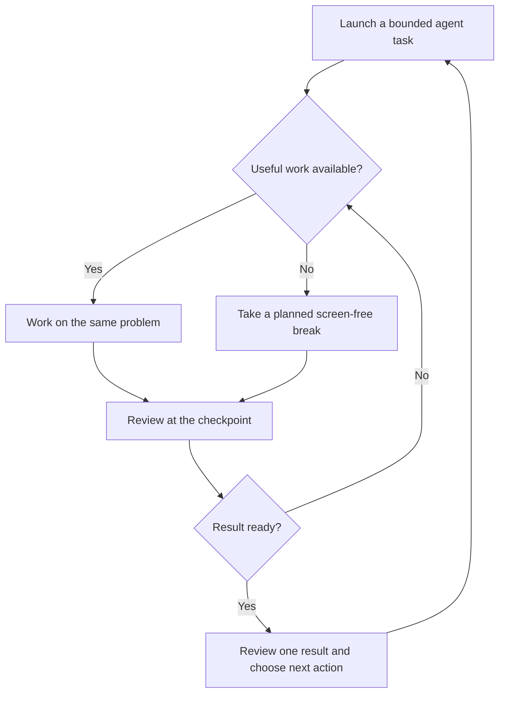

# Attention practice: a 14-day personal experiment

Version 1.1 · Updated 6 September 2026 · Created 5 September 2026 · Owner: Douglas Rojas

## Purpose and scope

Rebuild deliberate attention for reading and software work, especially when AI agents create waiting periods and repeated context switches. The aim is to start, stay with, and return to a chosen task without requiring a flow state. Two weeks is a reasonable experiment window, not a guaranteed recovery deadline.

Douglas reports that TikTok/Reels use has coincided with considerable difficulty concentrating, and that AI-agent bottlenecks have disrupted opportunities for flow over the past year. This is a reported experience, not a diagnosis or proof that either technology caused lasting impairment. There is no baseline measurement yet.

This document records the initial request, research synthesis, proposed strategy, measurement protocol, tracking templates, and decisions. Future observations and revisions should be appended with dates, preserving the original protocol. It is a working record, not a verbatim transcript. Future conversation turns and automated digests do not silently update this file; request an update or provide the log here so the same document can be revised.

## What the evidence supports

| Approach | Evidence and limits | Decision for this experiment |
|---|---|---|
| Reduce continuous phone internet access | Castelo et al. (2025), randomized delayed-intervention trial, 467 participants enrolled: blocking phone internet for two weeks improved objectively measured sustained attention. Blocking included Wi-Fi and mobile data; other-device internet and calls/texts remained available. Adherence and attrition limit interpretation. This is broader than stopping Reels alone. [1] | Remove short-video feeds and keep the phone outside focus sessions. This is a practical adaptation, not a replication of the trial. |
| Reduce short-video consumption | Nguyen et al. (2025), systematic review/meta-analysis, reports associations between greater short-form video use and poorer cognitive outcomes, including attention. Association cannot identify the cause of Douglas's difficulties or establish permanence. [2] | A 14-day break from TikTok, Reels, and Shorts is a reasonable behavioral experiment. |
| Practice focused attention | Mrazek et al. (2013), randomized trial of 48 undergraduates: a two-week mindfulness course improved working memory and reading comprehension and reduced mind-wandering relative to nutrition instruction. It involved structured instruction, not simply a few minutes using an app. [3] | Use 5–10 minutes of daily practice as an adjunct. This lighter routine is not the studied dose. |
| Be realistic about mindfulness | Whitfield et al. (2022), systematic review/meta-analysis: cognitive benefits were modest and did not show overall superiority to active comparators. Study quality and differences between interventions matter. [4] | Do not make meditation the sole intervention or promise a particular gain. |
| Protect sleep | Van Dongen et al. (2003), controlled experiment: repeated sleep restriction, including six-hour sleep opportunities, produced accumulating cognitive deficits over 14 days. [5] | Protect a consistent sleep window; record sleep as a major potential confounder. |
| Maintain physical activity | Singh et al. (2025), umbrella review: exercise benefits general cognition, memory, and executive function across diverse populations and protocols. This does not establish a specific two-week attention dose for a trained 30-year-old. [6] | Maintain usual football, strength training, and walking; do not add exhausting workouts for this experiment. |
| Reduce interruption costs | Leroy and Glomb (2018), four studies: brief ready-to-resume plans reduced attention residue and supported performance on interrupting tasks. The original work did not directly establish improved performance after returning to the original task. [7] | Leave a next-action note before switching. Batched agent review is an application of this principle, not an AI-specific validated treatment. |
| Avoid relying on brain games | Simons et al. (2016), broad review: strongest gains were on trained tasks; evidence for broad transfer to everyday cognition was weak. [8] | Practice the reading, reasoning, and review tasks you want to improve. Do not buy a brain-training subscription for this trial. |

Practical priority: remove frequent triggers; protect sleep; practice useful single-task work; add brief mindfulness; maintain exercise. The exact block lengths, agent-check rules, and targets below are coaching choices, not clinically validated doses. This is a focused evidence review, not an exhaustive systematic review. Some sources were accessible through indexed abstracts or institutional summaries rather than complete full text; no unavailable statistical detail is assumed.

## Working hypothesis

Agent waiting can become a cue for scrolling or checking another task. That repeatedly breaks engagement with the original problem. We will change the response to waiting and separately practice remaining with a chosen task. This is a hypothesis to test, not a claim about proven neurological changes.

## Day 0: establish the baseline

Use the next rested day for Day 0. Day 1 is the following day; Day 14 is two weeks after Day 0. If Day 0 is September 6, practice runs September 7–20, with the final assessment September 20. These are proposed dates, not scheduled reminders.

1. Capture the previous seven days of device screen-time totals for TikTok, Instagram, and YouTube, plus any available pickups. App totals do not distinguish Reels from messages or Shorts from long videos; label them accordingly. Estimate short-video time separately if necessary and label estimates.
2. Select a book or collection of substantial prose at a moderately challenging but understandable level, in one language. Choose four previously unread sections of similar length, difficulty, and topic, each long enough to keep reading for 20 minutes. Allocate two to baseline and two to final assessment before starting. Avoid a very easy baseline or a very interesting final selection. Material matching is approximate, not psychometrically validated.
3. Complete two 20-minute benchmark sessions, at least one hour apart, with a three-minute recall exercise after each. Record both start times so you can match them on Day 14.
4. Record sleep, caffeine timing/amount, stress 0–10, fatigue 0–10, and illness. Do not deliberately change medication or take extra stimulants for testing.
5. After baseline, configure the feed restrictions and choose tomorrow's first concrete work task.

Do not binge to obtain a more dramatic baseline. If you have already reduced feeds, record when; that baseline is still useful but is not an untreated comparison.

## Fixed 20-minute benchmark

This is a practical behavioral measure, not a clinical test, IQ test, ADHD screen, or measurement of a universal attention span.

**Keep these conditions identical on Day 0 and Day 14:** location, device or paper format, language, approximately the same time of day, timer, notification settings, and phone location. Put the phone away and silence notifications for both baseline and final testing. Do not make baseline artificially distracting. Use no AI, music with words, web lookup, or messaging during the benchmark. Match caffeine and sleep conditions as reasonably possible; record differences rather than manipulating sleep.

Start a 20-minute countdown and read. Keep a paper tally beside you. If attention drifts, return and continue; do not restart the clock or terminate the assessment. You are measuring how you manage distraction, not requiring perfect performance.

### Outcomes

| Metric | Definition | Interpretation |
|---|---|---|
| **Primary: voluntary off-task switches per 20 minutes (S)** | Tally each departure to an unrelated app, tab, phone, task, or deliberate unrelated activity. Returning ends that episode; moving among several unrelated apps before returning is one episode. An urge without acting is not a switch. Required reading navigation and recording the tally do not count. | Lower is better, provided comprehension is maintained. Captures behavioral control, not all internal distraction. |
| Time to first voluntary switch (T) | Record the elapsed minute when the first switch happens. If none, record “20+, capped.” | Secondary estimate of uninterrupted task engagement; it does not mean the mind never wandered. |
| Recall accuracy (Q), 0–5 | Close the text. In three minutes write one main claim and four distinct supporting points from what you read. Reopen and award 1 per accurate, nonduplicated point supported by the text; blanks/incorrect points score 0. Keep the notes. | Quality guardrail. Self-scoring and material difficulty limit reliability. It is not a validated comprehension scale. |
| Noticed mind-wandering (M), optional | Briefly tally when you notice your mind has wandered. | Descriptive only: greater awareness can increase this count despite improvement. Do not use it as a failure score. |
| External interruptions (E) | Separately tally interruptions initiated by others or unavoidable events. | Do not combine with voluntary switches. Flag a session as disrupted if these materially affect it. |

Read for the full interval even after a switch. If you must stop early, record actual duration and mark the session incomplete; do not compare a shortened count directly with 20-minute scores. If materially disrupted, retain the result and do one replacement session under normal conditions, recording the reason. Never repeatedly retest to obtain a better score.

### Before/after calculation

- Baseline S = average of the two Day 0 switch counts.
- Final S = average of the two Day 14 switch counts.
- Absolute change = baseline S minus final S. A positive value is improvement.
- If baseline S is greater than zero: percentage reduction = 100 × (baseline S − final S) / baseline S.
- Example only: baseline 6 and 4 → 5; final 3 and 3 → 3; reduction = 2 switches per 20 minutes, or 40%. These are not Douglas's results.
- If baseline is zero, percentage reduction is undefined. If below 3, emphasize absolute counts because percentages become unstable. Maintaining few switches with good recall may already be a successful result.
- Compare average Q and T as secondary outcomes. For a capped T, report the cap instead of pretending the true limit is known.

**Provisional practical target:** if baseline S is at least 3, aim for at least 30% fewer switches, with average recall no worse than baseline. Also aim to complete two 25-minute work blocks on at least three of Days 11–14. These are chosen goals, not validated thresholds or promised outcomes. If baseline recall is poor, investigate difficulty and aim for improvement rather than treating unchanged poor recall as sufficient success.

Two samples per time point reduce dependence on one unusually good session but remain noisy. No control group, blinding, or validated alternate forms means improvement cannot be attributed specifically to quitting feeds or to permanent cognitive change. Practice, sleep, motivation, material difficulty, and self-monitoring can all contribute. Report mixed outcomes honestly; do not combine everything into an invented “brain health” score.

## The daily intervention

**Revision, September 6:** Douglas prioritizes actual improvement over perfect abstinence. The flexible rules below supersede the original zero-feed rule; the earlier proposal is retained for traceability. Benchmark definitions remain unchanged.

- Protect the two daily practice blocks from social feeds on every device. Avoid using feeds as the default response to agent waiting.
- Allow one planned leisure scrolling window of 15–20 minutes outside protected work. This is a provisional starting allowance, not a scientifically established safe dose. If current use is substantial, aim initially to cut total recreational feed time across devices by approximately half; adjust after obtaining baseline data.
- Count Instagram, TikTok, and Facebook feed scrolling on computers as well as phones. Record total recreational feed minutes (including text/image feeds) alongside the existing short-video column, separating devices if feasible. Purposeful messaging is recorded separately.
- Track unplanned feed openings during work. Fewer interruptions and maintained/improved comprehension are central outcomes; zero leisure use is not required. If limits repeatedly fail, strengthen access restrictions or shorten the window. A lapse does not erase previous practice.

### Desktop versus phone: evidence and inference

Desktop social feeds can interrupt work; switching devices does not remove the feed or the task switch. The evidence checked does not establish that an equal dose of desktop scrolling causes greater, lesser, or identical long-term attention impairment compared with phone scrolling. Do not assign an invented numerical ranking. Phones can be accessible in more contexts; a desktop feed can sit one tab away from work. Which is more disruptive for Douglas depends on actual frequency, duration, and timing. These are practical inferences, not comparative clinical findings.

The phone-internet trial allowed internet on other devices and still found improvement. Therefore eliminating every form of online activity is not necessary to reproduce that feature of the study; it does not prove unrestricted desktop scrolling is harmless. [Study](https://pubmed.ncbi.nlm.nih.gov/39967678/).

For planning: repeated feed visits between agent checks deserve high priority; one bounded leisure session is easier to contain; opening a specific message or post and leaving is a different behavior from open-ended feed consumption. These priorities target work interruption and adherence, not a proven ranking of neurological harm.

### Rules for all 14 days

- No TikTok, Reels, or Shorts feeds. Remove or block the relevant apps/sites across phone and computer. If Instagram messaging is necessary, use two planned message windows and leave after messages; if the feed repeatedly captures you, move messaging to a route that avoids it or temporarily remove access. Essential communication remains available.
- Do not replace these feeds with endless Reddit, news, or agent-status refreshing. Intentional long-form entertainment is allowed; choose it before opening and define a stopping point.
- Phone outside reach, preferably outside the room, during focus blocks. Silence nonessential notifications.
- Before each block, write one deliverable: “Explain this function and its edge cases,” “Draft the acceptance criteria,” or “Review this diff against three requirements.”
- Protect enough opportunity for roughly 7–9 hours of sleep, with a consistent wake time. You previously reported about 6–7 hours; if that still applies, prioritize this rather than increasing training volume. Record actual sleep estimates.
- Keep normal exercise and meals. An easy walk or a five-minute screen-free break is a useful alternative to scrolling; no additional strenuous training is required.
- Keep tracking to about two minutes at day's end. A lapse is recorded; resume at the next block rather than restarting the entire two-week experiment.

### Progression

| Days | Focus practice | Mindfulness | Emphasis |
|---|---|---|---|
| 1–3 | 2 × 10 minutes daily | 5 minutes daily | Start despite boredom; stay with one chosen task. |
| 4–7 | 2 × 15 minutes daily | 8 minutes daily | Practice returning after distraction; batch agent checks. |
| 8–10 | 2 × 20 minutes daily | 10 minutes daily | Include one block of reading or reasoning without AI assistance. |
| 11–14 | 2 × 25 minutes daily | 10 minutes daily | Complete a useful artifact and check its quality. |

Use at least five minutes between blocks. Ordinary work can continue outside these sessions; these are protected practice blocks, not a ceiling on productivity. When possible use one reading/reasoning block and one software-work block. On nonwork days, substitute substantial reading or a small personal coding task.

**Adjustment rule:** advance only after two consecutive days completing both current-length blocks, with useful output and no more than one voluntary off-task switch in each block. Otherwise hold the current duration. If ten minutes is repeatedly too difficult, start at five and add five minutes after two successful days. A difficult day is information, not evidence of a damaged brain. Never lengthen the fixed benchmark to match the training progression.

**Mindfulness exercise:** sit comfortably and attend to breathing or a neutral external sound. Optionally count exhalations from 1 to 10. When you notice distraction, briefly label it “thinking” and return. The repetition is noticing and returning, not suppressing thoughts or achieving a blank mind. If inward attention increases distress, use eyes-open attention to sounds or walking, or discuss it with your therapist. The 5–10 minute dose is a practical starting point, not a reproduction of the structured research course.

## AI-agent workflow

Apply this during the protected work blocks first, so it does not require rebuilding your whole workflow.

1. Limit the block to one problem or workstream, even if more than one agent contributes to it. Prefer one active agent task initially when concurrency keeps pulling you away.
2. Before launch, define the required output, acceptance criteria, and the task you will do while it runs. For example: agent implements; you derive edge cases, inspect an adjacent function, or draft a review checklist.
3. Write a checkpoint note: “Current goal / where I stopped / next action / what I need from the agent.”
4. Choose the next review time before launching, usually at the block boundary. If a genuine approval blocks the current task, handle it intentionally and resume; do not turn necessary collaboration into a scored failure.
5. If waiting leaves nothing useful, take the planned screen-free break. Do not start an unrelated workstream solely to avoid waiting. Keep work on separate files when agent edits could conflict with yours.
6. At the checkpoint, review one result against the criteria, then choose the next action. A completion notification does not require immediate review when the current task remains useful; urgent or consequential failures are exceptions.

The exact concurrency limit and checkpoint timing are workflow experiments. We have not established that AI has damaged your attention. Track unplanned agent-status checks separately during normal work so we can see whether the workflow becomes less fragmented.

## Daily log

Blocks completed means you stayed with the planned task for its duration and produced a useful result; occasional returning is allowed. Record voluntary switches separately. Leave nonapplicable or unknown cells blank rather than entering zero.

| Day / date | Sleep h | Short-video min, measured or estimated | Planned block min × 2 | Blocks completed / 2 | Voluntary switches in both blocks | Unplanned agent checks | Mindfulness min | Stress 0–10 | Useful output / obstacle |
|---|---|---|---|---|---|---|---|---|---|
| 1 | | | 10 × 2 | | | | | | |
| 2 | | | 10 × 2 | | | | | | |
| 3 | | | 10 × 2 | | | | | | |
| 4 | | | 15 × 2 | | | | | | |
| 5 | | | 15 × 2 | | | | | | |
| 6 | | | 15 × 2 | | | | | | |
| 7 | | | 15 × 2 | | | | | | |
| 8 | | | 20 × 2 | | | | | | |
| 9 | | | 20 × 2 | | | | | | |
| 10 | | | 20 × 2 | | | | | | |
| 11 | | | 25 × 2 | | | | | | |
| 12 | | | 25 × 2 | | | | | | |
| 13 | | | 25 × 2 | | | | | | |
| 14 | | | 25 × 2 | | | | | | |

Overwrite planned durations if the adjustment rule holds you at a shorter block. The varying block lengths mean raw daily switch counts are not directly comparable; use the fixed benchmark for the main comparison.

### Benchmark record

| Session | Date/time | Passage | S switches | T first switch min, cap 20+ | Q recall / 5 | E external | Sleep / caffeine / stress / notes |
|---|---|---|---|---|---|---|---|
| Day 0 A | | | | | | | |
| Day 0 B | | | | | | | |
| Day 7 optional | | | | | | | |
| Day 14 A | | | | | | | |
| Day 14 B | | | | | | | |

If using the optional Day 7 session, select a fifth matched passage in advance. Use it for a midpoint signal, not a reason to overhaul the protocol after one disappointing score. On Day 14 the two benchmarks may replace that day's practice blocks to keep burden reasonable; note this in the daily log.

### Day 7 review

Check adherence before increasing effort. If scrolling continues, strengthen access restrictions. If practice is skipped, shorten the block and improve its timing. If sleep is consistently short, protect bedtime. If tasks are too broad, define smaller outputs. Record any change with its date. Do not change outcome definitions after seeing results.

### Day 14 interpretation

Record baseline and final averages, absolute change, percentage change where meaningful, recall quality, longest scheduled block actually completed, and how many of Days 11–14 met the work goal. Report adherence, sleep changes, and disruptions alongside results.

- Fewer switches + stable/improved recall + useful work: encouraging functional improvement. Continue the sustainable parts for another two weeks.
- Fewer switches but worse recall: may reflect staring or easier avoidance rather than better understanding; reassess material difficulty and task engagement.
- Benchmark improves but work does not: inspect workflow interruptions, ambiguity, and agent dependency. Transfer has not yet been demonstrated.
- No clear change with poor adherence or disrupted testing: inconclusive; simplify and repeat before judging effectiveness.
- No improvement despite reasonable adherence, or substantial ongoing impairment: discuss attention, sleep, stress, mood, and possible medication effects with a qualified clinician. The year-long functional difficulty you describe already makes a discussion with your therapist or doctor reasonable; you need not wait for Day 14. Do not self-diagnose ADHD from scrolling difficulty or flow patterns.

## Research tracking

A weekly automated research digest was successfully created on September 5, 2026. It is scheduled for Saturday mornings around 08:00 America/La_Paz, starting September 12, and continues weekly until changed or stopped. Timing is flexible within approximately an hour.

Each run searches the preceding seven days for human attention research, short-video use, digital-distraction interventions, mindfulness, sleep, and AI-assisted work interruptions/cognitive offloading. It prioritizes original peer-reviewed studies and rigorous reviews, labels preprints, separates association from causation, and supplies at most three meaningful findings with dates, source links, design, sample size when available, limitations, and implications for this protocol. If there is no meaningful new evidence, it should say so. Delivery is in ChatGPT; it is not continuous monitoring of your device use and does not automatically edit this document.

| Digest date | Paper/link | Design and sample | Result | Limitation | Change warranted? |
|---|---|---|---|---|---|
| Pending first digest | | | | | |

Do not change the protocol for every headline. Prioritize replicated findings and interventions relevant to adults and the actual outcome we want. Distinguish new publication dates from recently crawled old papers. News should lead back to the underlying study.

## Discussion and decision record

| Date | Entry |
|---|---|
| 2026-09-05 | Douglas requested research, a two-week strategy, baseline/final metrics, documentation, ongoing paper/news tracking, and useful diagrams. |
| 2026-09-05 | Proposed target: deliberate task engagement and useful output, without requiring flow. |
| 2026-09-05 | Selected a practical fixed benchmark plus daily work log; explicitly not a diagnostic attention test. |
| 2026-09-05 | Proposed a graded schedule, feed break, sleep protection, brief mindfulness, and batched agent review. Durations and thresholds are provisional coaching choices. |
| 2026-09-05 | Weekly research digest created successfully. |
| 2026-09-06 | User clarified that improvement, not perfection, is the goal and asked whether desktop IG/TikTok/Facebook scrolling also counts. Added a flexible feed allowance, cross-device tracking, and explicit limits on comparative evidence. |
| Pending | Confirm actual Day 0 date, usual short-video minutes, longest manageable block, typical agent wait duration, and sleep. These refine the plan but do not block starting. |
| 2026-09-08 | A prototype was built per the `build-initial-mvp` change: the primary switch tally (S), the agent-status-check subtype, the first-voluntary-switch definition (no switch → "20+, capped"; episode present but time unknown → "Unknown"), and the blank-is-not-zero rule for every count column are implemented as this protocol states them, and the September 6 flexible cross-device feed policy above is retained unchanged. The recall thresholds of 600 s (delay) and 210 s (duration) are recorded as flags only, never as eligibility gates, and remain chosen coaching values, not validated ones. Eligibility for Day 14 comparison relies on self-attestation of an uninterrupted interval rather than any automated or threshold-based check. No data has been collected on this prototype and no effect on attention is claimed; see `LIMITATIONS.md` for what was and was not tested. |

For subsequent check-ins, send: day/date; sleep; short-video minutes; completed blocks and duration; voluntary switches; agent checks; and one obstacle or observation. Include benchmark counts and recall notes on assessment days. No monitoring or measured improvement is implied until data is provided.

## References

1. Castelo N, et al. (2025). *Blocking mobile internet on smartphones improves sustained attention, mental health, and subjective well-being.* PNAS Nexus 4(2), pgaf017. [Publisher](https://academic.oup.com/pnasnexus/article/4/2/pgaf017/8016017) · [PubMed](https://pubmed.ncbi.nlm.nih.gov/39967678/).
2. Nguyen L, et al. (2025). *Feeds, feelings, and focus: A systematic review and meta-analysis examining the cognitive and mental health correlates of short-form video use.* [PubMed](https://pubmed.ncbi.nlm.nih.gov/41231585/).
3. Mrazek MD, Franklin MS, Phillips DT, Baird B, Schooler JW. (2013). *Mindfulness training improves working memory capacity and GRE performance while reducing mind wandering.* Psychological Science 24(5), 776–781. [PubMed](https://pubmed.ncbi.nlm.nih.gov/23538911/) · [Research institution summary](https://news.ucsb.edu/2013/013489/mindfulness-improves-reading-ability-working-memory-and-task-focus-say-uc-santa-barbara).
4. Whitfield T, et al. (2022; online 2021). *The effect of mindfulness-based programs on cognitive function in adults: A systematic review and meta-analysis.* Neuropsychology Review. [Full text](https://pmc.ncbi.nlm.nih.gov/articles/PMC9381612/).
5. Van Dongen HPA, Maislin G, Mullington JM, Dinges DF. (2003). *The cumulative cost of additional wakefulness: Dose-response effects on neurobehavioral functions and sleep physiology from chronic sleep restriction and total sleep deprivation.* Sleep. [PubMed](https://pubmed.ncbi.nlm.nih.gov/12683469/).
6. Singh B, et al. (2025). *Effectiveness of exercise for improving cognition, memory and executive function: A systematic umbrella review and meta-meta-analysis.* [PubMed](https://pubmed.ncbi.nlm.nih.gov/40049759/).
7. Leroy S, Glomb TM. (2018). *Tasks interrupted: How anticipating time pressure on resumption of an interrupted task causes attention residue and low performance on interrupting tasks and how a ready-to-resume plan mitigates the effects.* Organization Science 29(3), 380–397. [DOI](https://doi.org/10.1287/orsc.2017.1184) · [Research institution summary](https://www.washington.edu/news/2018/01/16/task-interrupted-a-plan-for-returning-helps-you-move-on/).
8. Simons DJ, et al. (2016). *Do brain-training programs work?* Psychological Science in the Public Interest. [PubMed](https://pubmed.ncbi.nlm.nih.gov/27697851/).
